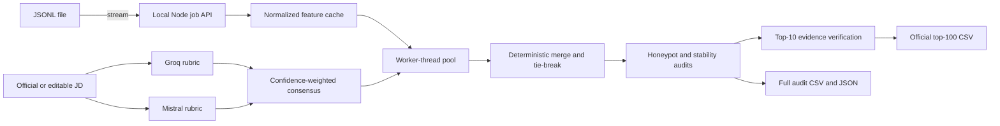
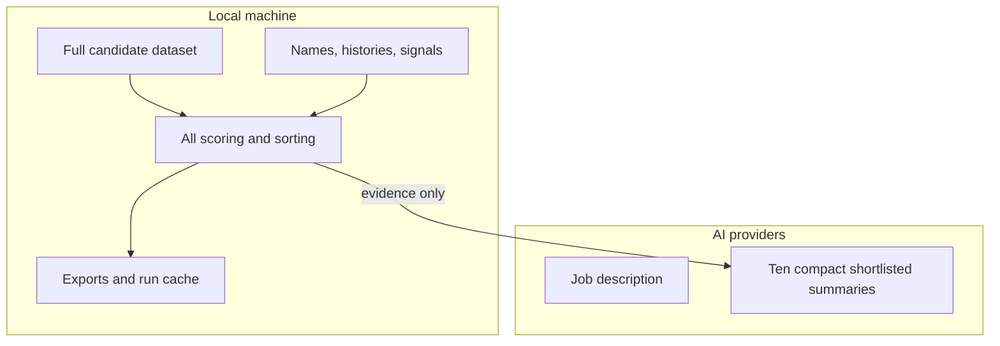
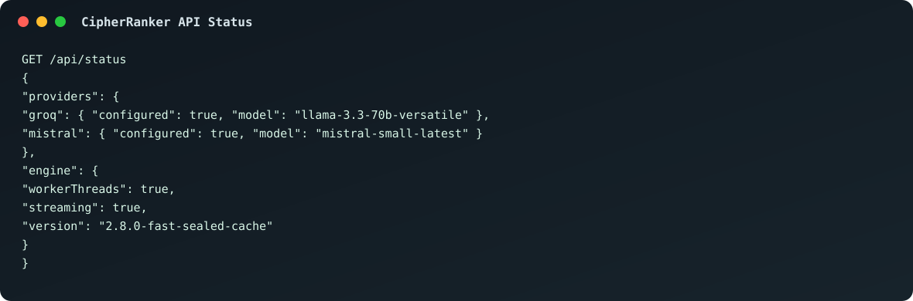
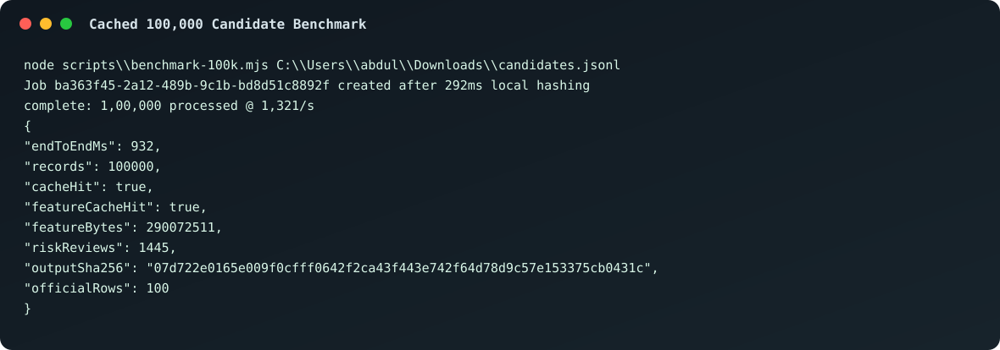
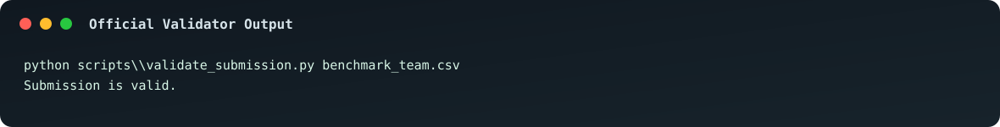

# CipherRanker Flagship

Local-first recruitment intelligence for the Redrob Data & AI Challenge. CipherRanker streams large candidate datasets through deterministic parallel scoring, independently derives a rubric with Groq and Mistral, audits adversarial profiles, measures shortlist stability, and produces the exact official top-100 CSV.

## Why It Is Different

- **Complete coverage:** every uploaded record is scored locally; only 10 compact shortlisted summaries are sent to AI.
- **Independent jury:** Groq and Mistral design rubrics independently before a confidence-weighted consensus is formed.
- **Evidence-bound:** each score component links to its source field and AI wording is rejected when it invents experience.
- **Adversarial review:** explicit honeypots, contradictory skills, timeline inconsistencies and repeated profile signatures are surfaced with evidence.
- **Reproducible:** each sealed run records dataset, JD, rubric and output SHA-256 hashes.
- **Fast reruns:** the first full run builds a normalized local feature cache; subsequent sealed reruns can reopen and export the exact 100,000-record ranking in under a second on the demo machine.
- **Submission-safe:** the official export is generated separately from the complete 100,000-row audit.

## Architecture



## Privacy Boundary



Candidate names are displayed but explicitly excluded from scorer text. Location is neutral unless the JD contains preferred locations. API keys remain server-side in `.env.local` and are excluded from Git.

## Run Locally

```powershell
Copy-Item .env.example .env.local
# Add GROQ_API_KEY and MISTRAL_API_KEY to .env.local
npm install
npm run dev
```

Open `http://127.0.0.1:5173`, paste the target JD, and upload JSON or JSONL candidate data.

## Netlify Drag-And-Drop UI

The static UI build is available in `netlify-deploy/`. Drag that folder into Netlify Drop to publish the frontend.

Important: Netlify static hosting only serves the React interface. The full 100,000-record ranking engine, worker threads, local caches, Groq/Mistral calls, and validator exports run through the local Node API with `node server.mjs`.

## Verification

```powershell
npm test
npm run build
npm run benchmark -- C:\path\to\candidates.jsonl
python scripts\validate_submission.py benchmark_team.csv
```

Measured on the local demo machine with `C:\Users\abdul\Downloads\candidates.jsonl`:

| Run mode | End-to-end | Notes |
| --- | ---: | --- |
| First cache build | 349.7s | Builds the 290 MB normalized feature cache from the 487 MB JSONL. |
| Feature-cache rerank | 90.6s | Scores all 100,000 records from normalized features. |
| Sealed run cache hit | 0.93s | Reopens the exact deterministic run and exports the official CSV. |

The latest validated output checksum is `07d722e0165e009f0cfff0642f2ca43f443e742f64d78d9c57e153375cb0431c`.

## Working Evidence

The screenshots below are generated from the actual local API, benchmark, and validator outputs.







The official export must contain exactly:

```text
candidate_id,rank,score,reasoning
```

with 100 data rows, deterministic candidate-ID tie-breaking, and no `HP_*` identifiers.

## Judge Demo

1. Upload the official 100,000-record JSONL dataset.
2. Watch live feature-cache, worker throughput, AI rubric and audit phases.
3. Inspect Groq/Mistral agreement and baseline-to-consensus rank movement.
4. Open a candidate to trace evidence and shortlist stability.
5. Inspect explicit honeypots and the risk-review queue.
6. Export the official CSV and run the supplied validator.
7. Compare the output checksum with the sealed run manifest.

## Limitations

- AI provider latency depends on external services; deterministic local ranking and exports remain available through fallback behavior.
- Stability is measured against controlled rubric-weight perturbations, not demographic attributes that are absent from the dataset.
- Suspicious valid candidates are review-flagged rather than automatically removed; only validator-invalid `HP_*` records are quarantined from submission.
