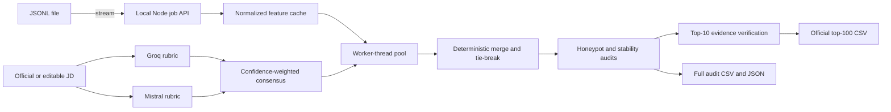
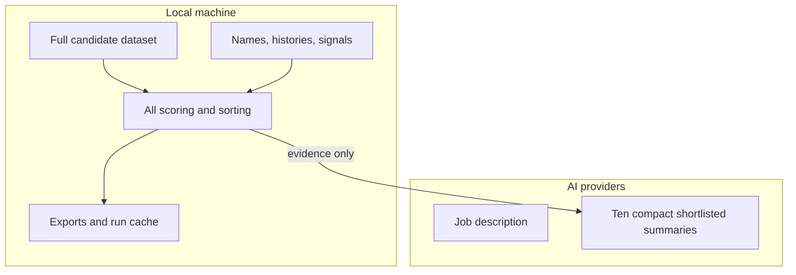

# CipherRanker

Local-first recruitment intelligence for the Redrob Data & AI Challenge. CipherRanker streams large candidate datasets through deterministic parallel scoring, independently derives a rubric with Groq and Mistral, audits adversarial profiles, measures shortlist stability, and produces the exact official top-100 CSV.

## Why It Is Different

- **Complete coverage:** every uploaded record is scored locally; only 10 compact shortlisted summaries are sent to AI.
- **Independent jury:** Groq and Mistral design rubrics independently before a confidence-weighted consensus is formed.
- **Evidence-bound:** each score component links to its source field and AI wording is rejected when it invents experience.
- **Adversarial review:** explicit honeypots, contradictory skills, timeline inconsistencies and repeated profile signatures are surfaced with evidence.
- **Reproducible:** each sealed run records dataset, JD, rubric and output SHA-256 hashes.
- **Fast reruns:** the first full run builds a normalized local feature cache; subsequent sealed reruns can reopen and export the exact 100,000-record ranking in under a second on the demo machine.
- **Submission-safe:** the official export is generated separately from the complete 100,000-row audit.

## Architecture



## Privacy Boundary



Candidate names are displayed but explicitly excluded from scorer text. Location is neutral unless the JD contains preferred locations. API keys remain server-side in `.env.local` and are excluded from Git.

## Local Installation

```powershell
git clone https://github.com/Sameer8549/CipherRanker.git
cd CipherRanker
npm install
Copy-Item .env.example .env.local
notepad .env.local
```

Add your server-side provider keys to `.env.local`:

```text
GROQ_API_KEY=your_groq_key
MISTRAL_API_KEY=your_mistral_key
```

Start the local full-stack app:

```powershell
npm run dev
```

Open:

```text
http://127.0.0.1:5173
```

For the official 100,000-candidate dataset, use the local path runner inside the UI:

```text
C:\Users\abdul\Downloads\candidates.jsonl
```

This is the recommended path for the challenge submission because the official dataset is about
487 MB. Running locally avoids hosted disk limits, avoids uploading private candidate data to a
cloud runtime, and enables the normalized feature cache for fast reruns.

### Local Commands

```powershell
npm test
npm run build
npm run benchmark -- C:\Users\abdul\Downloads\candidates.jsonl
python scripts\validate_submission.py benchmark_team.csv
```

## Deployed Web UI

The deployed apps are for the UI demo, provider-readiness checks, and smaller JSONL/JSON samples:

- Netlify UI: https://rankker.netlify.app/
- Catalyst full-stack demo: https://cipherranker-50043309761.development.catalystappsail.in/

The hosted Catalyst app intentionally stops very large uploads before the platform runs out of
temporary disk. Use the local installation above for the full official 487 MB `candidates.jsonl`
run and final CSV generation.

Optional hosted configuration:

```text
VITE_API_BASE_URL=https://cipherranker-50043309761.development.catalystappsail.in
CORS_ORIGIN=https://rankker.netlify.app
```

Provider keys must stay server-side only. Do not place Groq or Mistral keys in Netlify frontend
environment variables.

### Zoho Catalyst full-stack deployment

The repository also includes an AppSail configuration that serves the React build and ranking
API from one Catalyst URL.

Verified Catalyst full-stack app:

https://cipherranker-50043309761.development.catalystappsail.in/

Create a dedicated Catalyst project named `CipherRanker`, associate this directory with it,
and deploy the AppSail:

```powershell
npx zcatalyst-cli init project --force --org 60074625517
npx zcatalyst-cli deploy --only appsail
```

After the first deployment, add fresh `GROQ_API_KEY` and `MISTRAL_API_KEY` values in the
AppSail environment-variable settings and restart the service. Never commit provider keys to
`app-config.json`, `.env` files, Git history, or frontend build variables.

The hosted health check is available at `/api/status`; it reports backend readiness, engine
version, and whether Groq/Mistral keys are configured without exposing secrets.

## Verification

```powershell
npm test
npm run build
npm run benchmark -- C:\path\to\candidates.jsonl
python scripts\validate_submission.py benchmark_team.csv
```

Measured on the local demo machine with `C:\Users\abdul\Downloads\candidates.jsonl`:

| Run mode | End-to-end | Notes |
| --- | ---: | --- |
| First cache build | 349.7s | Builds the 290 MB normalized feature cache from the 487 MB JSONL. |
| Feature-cache rerank | 90.6s | Scores all 100,000 records from normalized features. |
| Sealed run cache hit | 0.93s | Reopens the exact deterministic run and exports the official CSV. |

The latest validated output checksum is `07d722e0165e009f0cfff0642f2ca43f443e742f64d78d9c57e153375cb0431c`.

## Working Evidence

The screenshots below are generated from the actual local API, benchmark, and validator outputs.


The official export must contain exactly:

```text
candidate_id,rank,score,reasoning
```

with 100 data rows, deterministic candidate-ID tie-breaking, and no `HP_*` identifiers.

## Judge Demo

1. Run the official 100,000-record JSONL dataset through the local path runner.
2. Watch live feature-cache, worker throughput, AI rubric and audit phases.
3. Inspect Groq/Mistral agreement and baseline-to-consensus rank movement.
4. Open a candidate to trace evidence and shortlist stability.
5. Inspect explicit honeypots and the risk-review queue.
6. Export the official CSV and run the supplied validator.
7. Compare the output checksum with the sealed run manifest.

## Limitations

- AI provider latency depends on external services; deterministic local ranking and exports remain available through fallback behavior.
- Stability is measured against controlled rubric-weight perturbations, not demographic attributes that are absent from the dataset.
- Suspicious valid candidates are review-flagged rather than automatically removed; only validator-invalid `HP_*` records are quarantined from submission.
